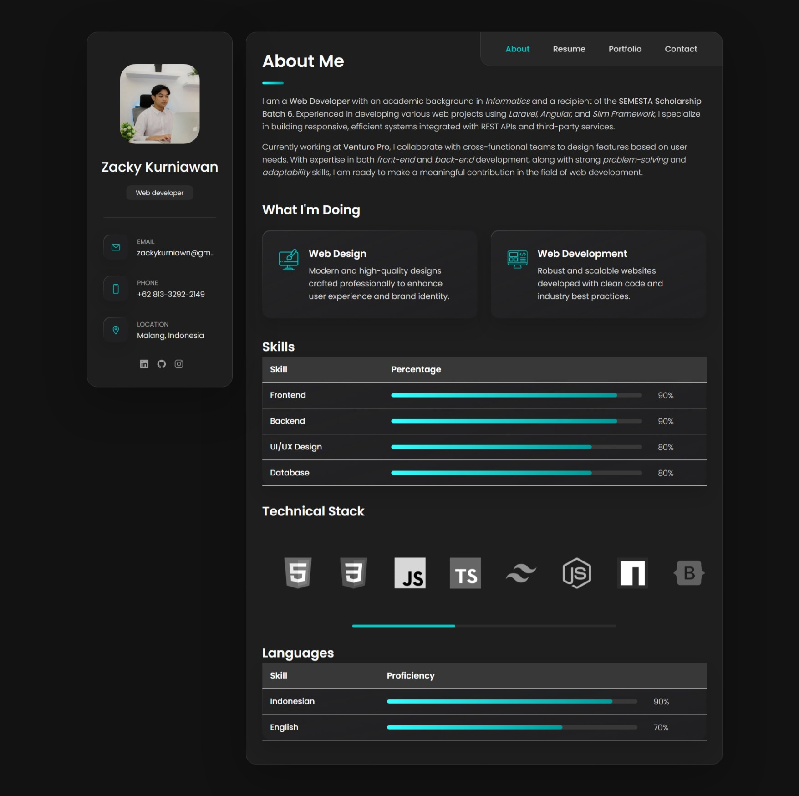

# Zacky Kurniawan - Personal portfolio

Zacky Kurniawan's portfolio highlighting informatics education and practical experience in web development, UI/UX design, and modern web technologies.

---

## Demo

### 💻 Desktop View

- **About**
  

- **Resume**
  

- **Portfolio**
  

- **Contact**
  

---

### 📱 Mobile View

- **About**
  

- **Resume**
  

- **Portfolio**
  

- **Contact**
  

---

## License

This project is licensed under the [MIT License](LICENSE).
